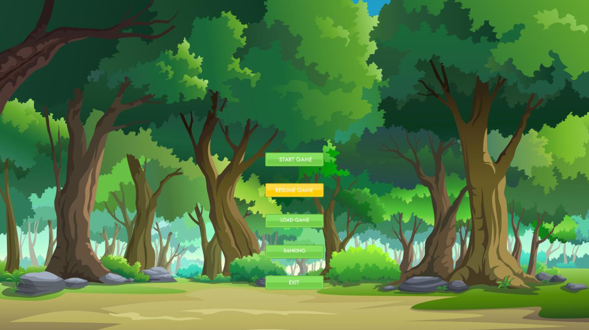
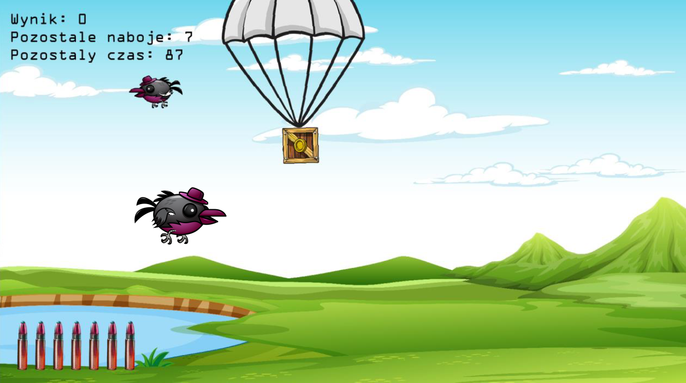

# Duck Shooter
2D game inspired by Duck Hunt. Game developed in 2022.

## Technologies Used
### Languages
- C++
### Libraries
- Allegro 5.2 – game engine

## Example Screenshots
### Menu

### Game

## Installation
Allegro 5 library needs to be installed before starting the application. It can be downloaded from [authors site.](https://liballeg.org/)

## Contribution
### Assets
- Bird - bevouliin [source](bevouliin.com)
- Backgrounds - [freepik.com](freepik.com)
- Others
### Inspiration
- Duck Hunt
